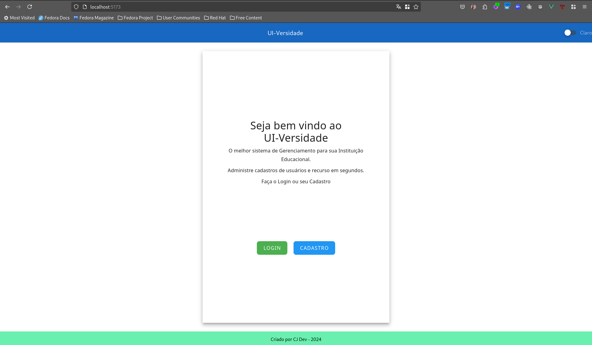
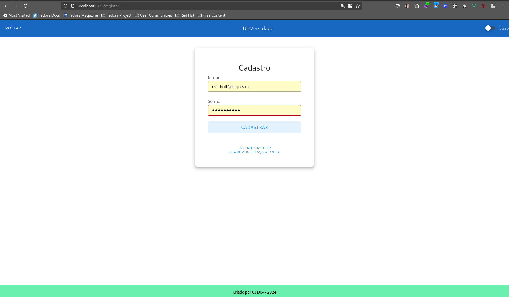
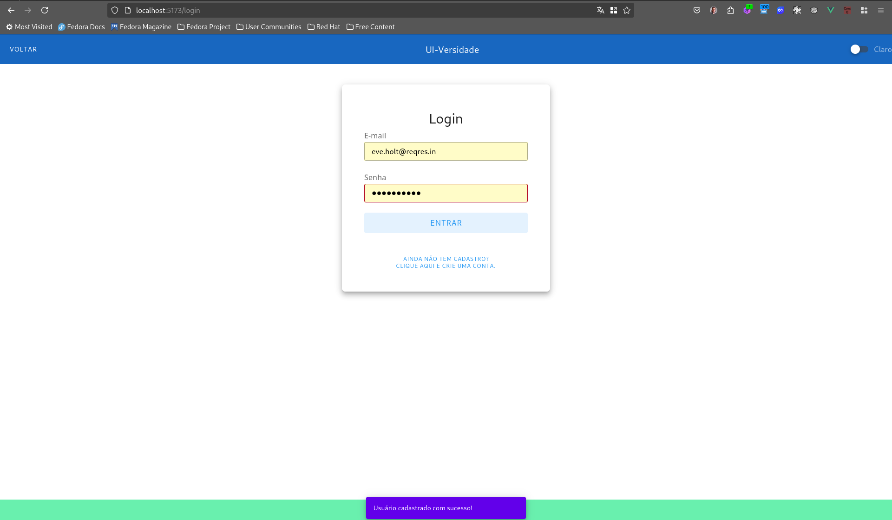
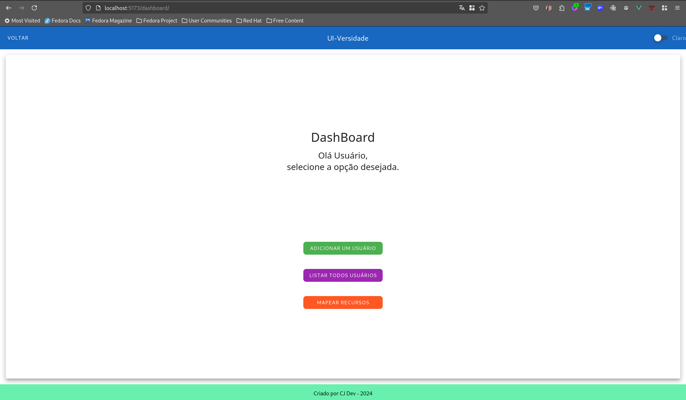
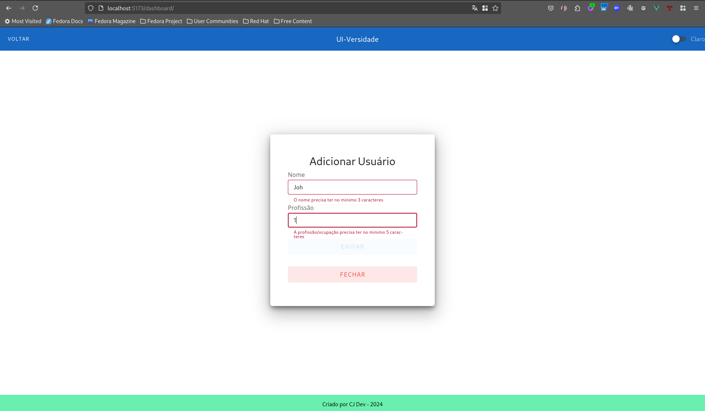
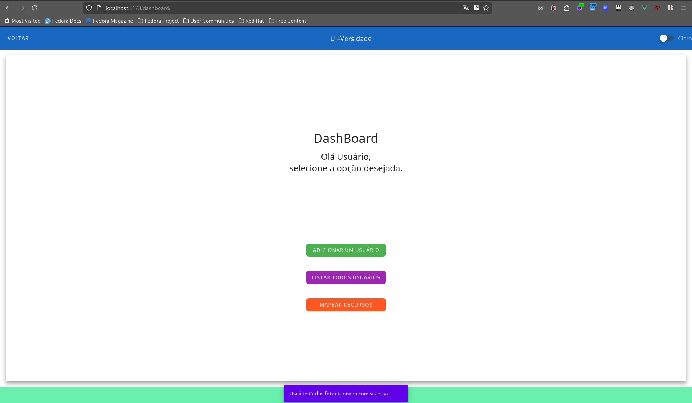
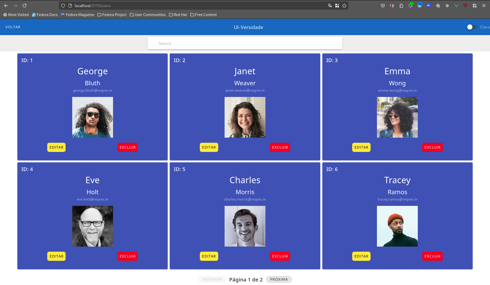
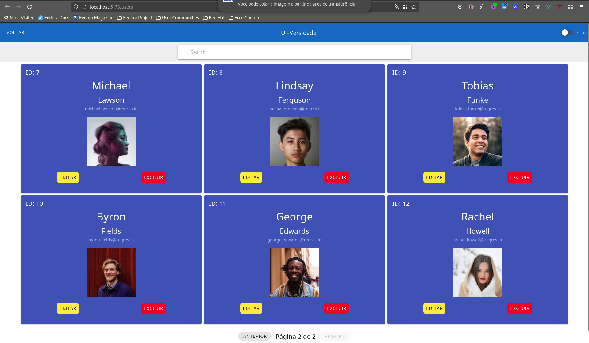
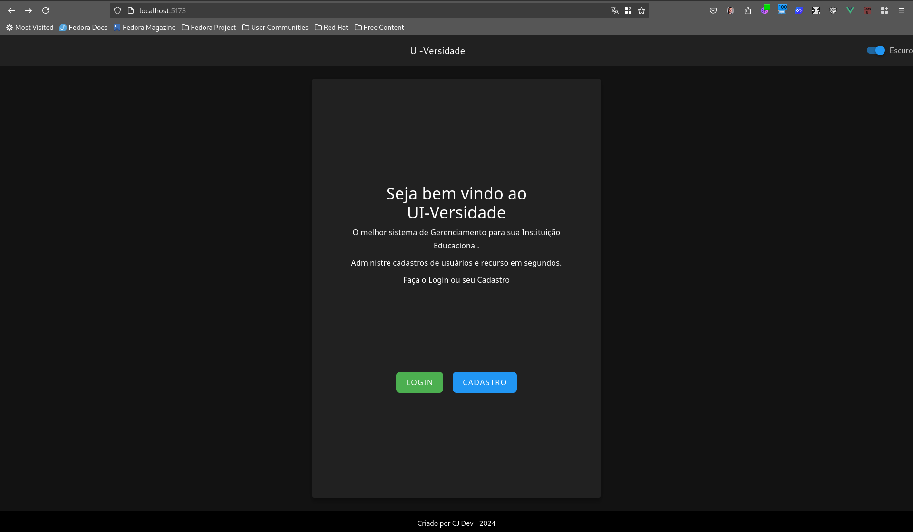

# UI-versidade

#### Descrição Geral

Este projeto surgiu como "resposta" à um [desafio técnico](DESAFIO.md) proposto pela Bobby.
O objetivo era criar um CRUD semelhante à uma dashboard/sistema para gerenciar usuários, recursos e gráficos
de forma intuitiva, visualmente agradável e responsiva para todos dispositivos.

URL da Aplicação : [UI-versidade]()

# Tecnologias

| Tecnologia | Versão (ideal) |
| ---------- | --------------- |
| VueJS      | ^3.4.29         |
| Vuetify    | ^3.6.13         |
| Vite       | ^5.3.1          |
| Pinia      | ^4.18.2         |
| Vue Router | ^4.3.3          |
| NodeJS     | ^20.15.1        |
| npm        | ^10.7.0         |

# Pré-requisitos e Instalação

- Baixe ou defina a versão do NodeJS para qualquer versão entre 18.x.x e LTS (use o [Node Version Manager](https://github.com/nvm-sh/nvm) para instalar a versão correta)
- Clone  este repositório.
- Abra o terminal bash no repositório, altere o caminho do diretório para `/ui-versidade` e execute o comando `npm i` ou `npm install` para instalar todos os pacotes BackEnd.
- Após tudo instalado, inicie o servidor local executando o comando `npm run server` ainda na mesma pasta.

# Estrutura de Diretórios

```txt

+---teste-tecnico-front
|   +---ui-versidade
|   |   +---public
|   |   +---src
|   |   |   +---assets
|   |   |   +---components
|   |   |   +---helpers
|   |   |   +---plugins
|   |   |   +---router
|   |   |   +---services
|   |   |   +---stores
|   |   |   +---styles
|   |   |   +---views
|   |   |   App.vue
|   |   |   mains.js
|   |   .env
|   |   .eslintrc.js
|   |   .gitignore
|   |   .prettierrc.json
|   |   index.html
|   |   .jsconfig.json
|   |   index.html
|   |   package-lock.json
|   |   package.json
|   |   vite.config.js
|   |   vitest.config
|   |   ...(config files)


```

# Como o Projeto funciona

Este projeto é uma aplicação [Serverless](https://en.wikipedia.org/wiki/Serverless_computing) com características de uma [SPA](https://developer.mozilla.org/en-US/docs/Glossary/SPA), que possui uma [api fictícia (Reqres)](https://reqres.in/) para consumo de dados através da UI criada.`<br>`
Utilizei a biblioteca de gerenciamento de estados Pinia, por ser a atual(2024) biblioteca mantida pelos desenvolvedores do Vue e para
melhor administrar a reatividade entre components e páginas da aplicação, evitando código extenso e repetitivo.
O boilerplate do projeto foi construído com base na instalação default do [Vite](https://vitejs.dev/guide/), e customizado por minha parte conforme mostrado acima na seção Estrutura de Diretórios.
Para evitar a extensão de estilos CSS e facilitar o desenvolvimento de funcionalidades mais avançadas, utilizei a biblioteca de UI código aberto [Vuetify](https://vuetifyjs.com/en/).

O projeto foi segmentado na seguinte lógica:

- O componente App.vue será uma espécie de "Hub" do projeto onde às Views serão renderizadas sem a necessidade de recarregamento de toda a página (conceito [SPA](https://developer.mozilla.org/en-US/docs/Glossary/SPA)).
- As Views são as "páginas" contendo as Interfaces de Usuário composta por Componentes filhos.
- Os Services funcionam como um intermédio entre os Stores e os eventos/ações dos Componentes.
- Nas Stores do Pinia contém a lógica de requisições e consumo de API, gerenciadas por meio de Actions e, para alguns dados importantes, armazenados como States.
- A componente Router possui todas as rotas utilizadas na aplicação com path's e names.
- A pasta Helpers foi criada para guardar funções/métodos reutilizáveis com características de formatação e manipulação de dados.
- Apesar de existir uma pasta Styles contendo o css geral da aplicação, optei por utilizar a tag HTML nos arquivos .vue, aplicando em formato SCSS.
- Para praticidade e flexibilidade no código, utilizei a Composition API do Vue 3.
- Todas requisições feitas na API possuem tratamento de erros com blocos try/catch e janelas de notificação em formato de SnackBar.

Para testar localmente, você precisará criar um arquivo `.env` no caminho do diretório para `/ui-versidade`. Neste arquivo, você precisa definir a(s) variável(eis) de ambiente:

#### Exemplo:

```js
    VITE_API_URL="https://reqres.in/api"
```

# Instruções de Uso da aplicação:

O projeto é um MVP bem intuitivo e simples, ao carregar a tela inicial, você verá uma interface com 2 opções: Login e Cadastro.



Clicando em ambas opções, você será redirecionado para uma página de criação de Cadastro/Login.



Para aumentar o dinamismo na experiência de usuário, implementei uma funcionalidade de troca entre as opções de Cadastro e Login de forma
instantânea. Ao criar um usuário você receberá uma mensagem de confirmação e será direcionado para o formulário de Login.



Logando no sistema, você será redirecionado para a Dashboard com as opções: Adicionar novo usuário, Listar todos usuários e Mapear Recursos.



Clicando em Adicionar novo usuário, você irá para um formulário com validação para adição de nome e profissão. Ao confirmar, você receberá a mensagem de confirmação e retornará para a Dashboard.





Partindo para Listar todos usuários, você será redirecionado para um container de cards renderizados com informações consumidas da API:




Clicando em Voltar, no Cabeçalho da aplicação, você retornará para última página visitada, retornando à Dashboard.
É possível notar que existe uma funcionalidade de troca entre Modo Claro e Escuro para melhorar a experiência do usuário.



#### Observações:

Por existir uma limitação de consumo da API (afinal, é fictícia e para fins de exemplificação), alguns fluxos foram adaptados para implementação das
funcionalidades do desafio:

```js
     async listUsers() {
      try {
        // Numa aplicação em produção e com uma API Restful substituiríamos o número da página fixa por um parâmetro da função
        const urlOne = `${API_BASE_URL}/users?page=1`
        const responseOne = await axios.get(urlOne)
        const urlTwo = `${API_BASE_URL}/users?page=2`
        const responseTwo = await axios.get(urlTwo)

        const response = {
          data: [...responseOne.data.data, ...responseTwo.data.data],
          page: responseOne.data.page,
          per_page: responseOne.data.per_page,
          total: responseOne.data.total,
          total_pages: responseOne.data.total_pages
        }
        return response
      } catch (error) {
        return error
      }
    },
```

Havia um planejamento de finalizar com a criação de Testes e Implementação do Apex Chart, mas para evitar o atraso em partes mais cruciais,
optei por deixar para futuras alterações. Abaixo segue a lista de melhorias planejadas:

- Adicionar animações de transição e expansão em componentes do projeto.
- Implementar os gráficos do ApexChart para visualizar os recursos da API na opção Mapear Recursos da página de Dashboard.
- Criar e implementar os Testes Unitários e de Aceitação.
- Adicionar o README em Inglês.
- Refinar o Layout da UI (fontes, quebras de linha, cores, espaçamento, etc)
- Adicionar Componentização de mais partes do projetos.
